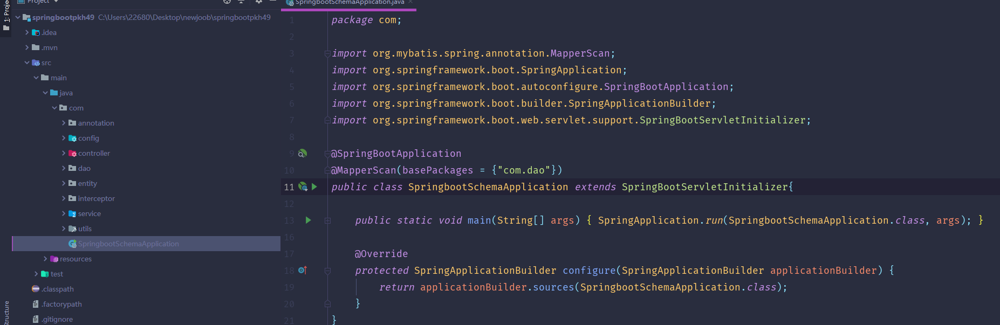
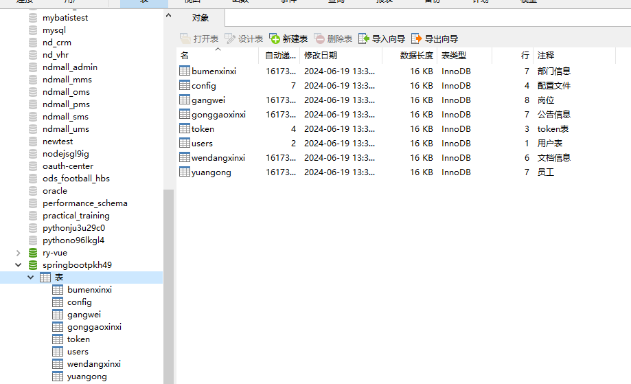
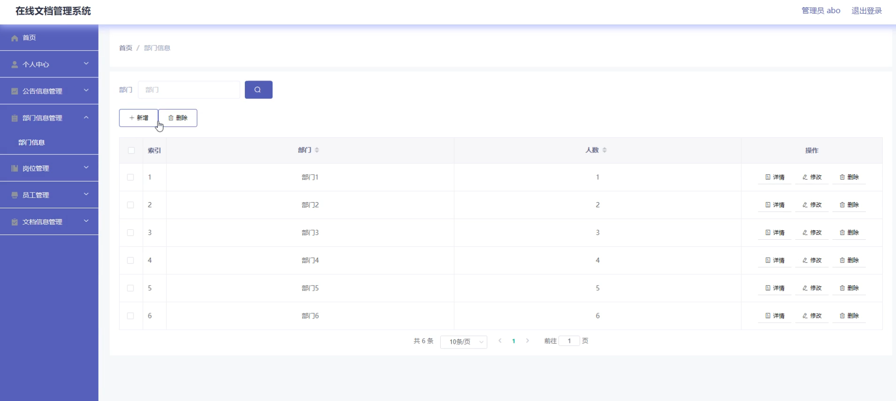
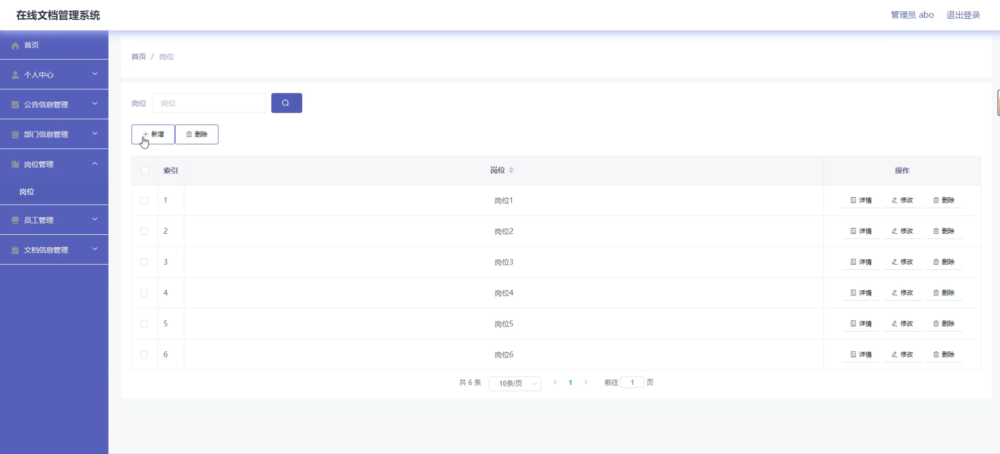
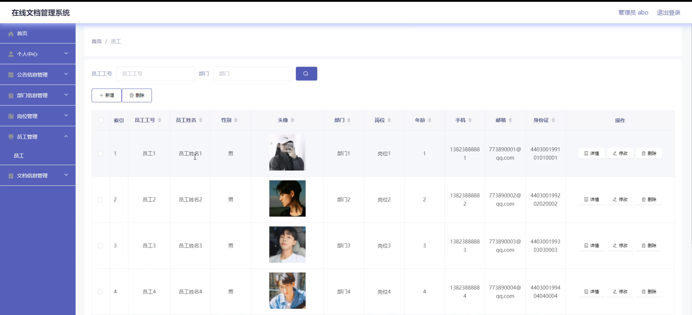
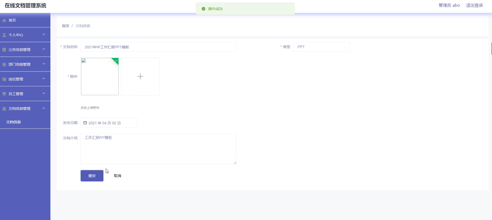
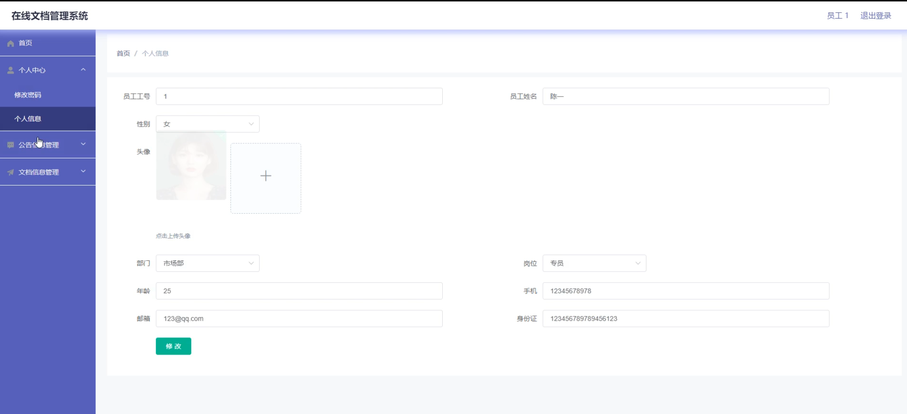

# 基于SpringBoot的在线文档管理系统

#### 介绍

基于SpringBoot的在线文档管理系统是一款专为企业设计的高效文档管理平台，旨在提升文档管理的便捷性、安全性和协作性。随着企业信息化进程的加快，传统的文档管理方式已无法满足现代企业对于信息管理的高效和精准要求。本系统通过SpringBoot框架实现，具有高扩展性和稳定性，能够适应企业日益增长的需求。

#### 技术栈介绍

后端技术栈：Springboot+Mysql+Maven

前端技术栈：Vue+Html+Css+Javascript+ElementUI

开发工具：Idea+Vscode+Navicate

#### 系统功能介绍

管理员端功能模块

个人中心：管理员可以在个人中心查看和编辑个人信息，包括修改密码和更新联系方式，确保个人信息的准确性。

公告信息管理：管理员可以发布和管理公告信息，确保所有员工及时获取重要通知和信息。

部门信息管理：管理公司的部门信息，包括新增、修改和删除部门，方便组织结构的管理和调整。

岗位管理：管理公司岗位信息，设置和调整岗位职责，确保岗位设置合理。

员工管理：管理员工信息，包括新增、修改和删除员工，分配员工岗位和部门，确保人员信息的准确和及时更新。

文档信息管理：管理所有的文档信息，包括上传、修改、删除文档，设置文档权限，确保文档的安全性和可访问性。

员工端功能模块

个人中心：员工可以在个人中心查看和编辑个人信息，包括修改密码和更新联系方式，确保个人信息的准确性。

公告信息管理：查看公告信息，及时获取公司发布的重要通知和信息，确保信息的传达和沟通。

文档信息管理：查看、下载和上传文档，进行文档的共享和协作，确保文档的高效管理和使用。

#### 系统作用

对管理员的作用

高效管理：系统提供了完善的管理工具，帮助管理员高效地管理公司组织结构和员工信息，确保管理工作的高效性和准确性。

信息传达：通过公告信息管理模块，管理员可以快速传达公司重要通知和信息，确保信息的及时传递和沟通。

文档安全：文档信息管理模块确保了文档的安全性，管理员可以设置文档权限，防止未经授权的访问和修改。

对员工的作用

信息获取：员工可以通过系统及时获取公司发布的公告信息，确保信息的透明和沟通的顺畅。

文档管理：员工可以方便地查看、下载和上传文档，进行文档的共享和协作，提高工作效率和团队合作水平。

个人管理：个人中心模块帮助员工管理和更新个人信息，确保个人信息的准确性和及时性。

#### 系统功能截图

代码结构

数据库表

登录

部门信息

岗位管理

员工管理

文档信息

员工端个人信息

#### 总结

基于SpringBoot的在线文档管理系统通过角色分工和功能模块的设计，实现了对企业文档的高效管理。管理员可以通过系统进行高效的组织管理和信息传达，确保文档的安全性和可访问性；员工则可以方便地获取和管理文档，提升工作效率和团队协作能力。该系统不仅提高了文档管理的便捷性和安全性，也为企业的信息管理和沟通提供了有力的支持。

#### 使用说明

创建数据库，执行数据库脚本 修改jdbc数据库连接参数 下载安装maven依赖jar 启动idea中的springboot项目

后台地址：http://localhost:8080/springbootpkh49/admin/dist/index.html

管理员  abo 密码 abo

